# What's the Weather Like? Using Python API

## Goal

Whether financial, political, or social -- data's true power lies in its ability to answer questions definitively. So let's take what you've learned about Python requests, APIs, and JSON traversals to answer a fundamental question: "What's the weather like as we approach the equator?"

## WeatherPy

Creating a Python script to visualize the weather of 500+ cities across the world of varying distance from the equator. 

Plot the following:

* Temperature (F) vs. Latitude

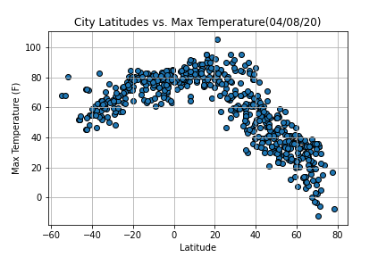

* Humidity (%) vs. Latitude

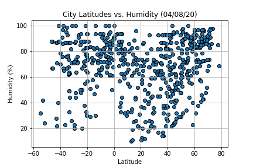

* Cloudiness (%) vs. Latitude

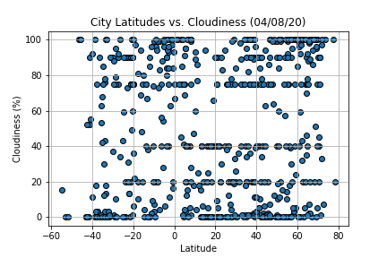

* Wind Speed (mph) vs. Latitude

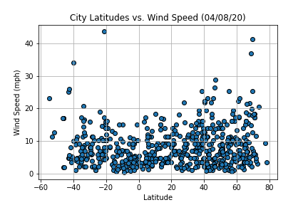

Your second requirement is to run linear regression on each relationship, only this time separating them into Northern Hemisphere (greater than or equal to 0 degrees latitude) and Southern Hemisphere (less than 0 degrees latitude):

* Northern Hemisphere - Temperature (F) vs. Latitude

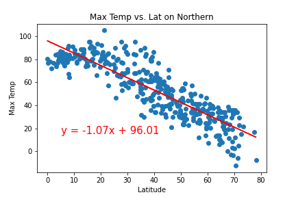

* Southern Hemisphere - Temperature (F) vs. Latitude

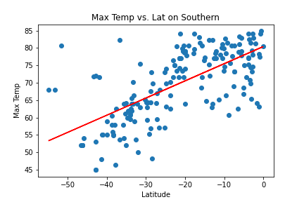

* Northern Hemisphere - Humidity (%) vs. Latitude

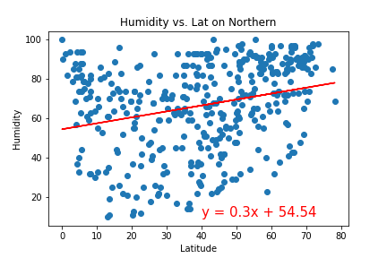

* Southern Hemisphere - Humidity (%) vs. Latitude

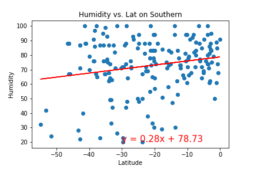

* Northern Hemisphere - Cloudiness (%) vs. Latitude

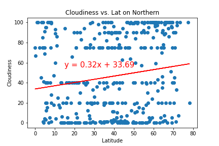

* Southern Hemisphere - Cloudiness (%) vs. Latitude

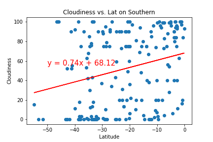

* Northern Hemisphere - Wind Speed (mph) vs. Latitude

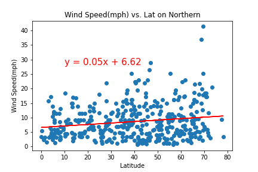

* Southern Hemisphere - Wind Speed (mph) vs. Latitude

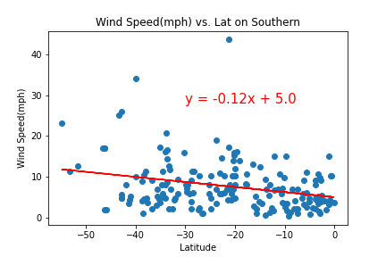

## VacationPy

Use jupyter-gmaps and the Google Places API for this part of the assignment.

* Create a heat map that displays the humidity for every city.

* Narrow down the DataFrame to find your ideal weather condition.

* Using Google Places API to find the first hotel for each city located within 5000 meters of your coordinates.

* Plot the hotels on top of the humidity heatmap with each pin containing the **Hotel Name**, **City**, and **Country**.

